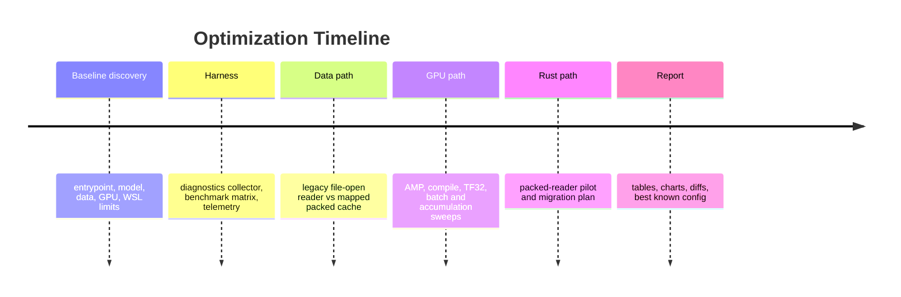

# lkjai Training Performance Report

## Executive Summary

The implemented suite records environment diagnostics, reproducible training benchmarks, telemetry, charts, diffs, and a Rust pilot path. The current host is WSL2, so native Linux observability is reduced for PCI root-port inspection, perf events, and some NVIDIA management operations.

Best known configuration: `compile-postwarm-short/compile_mapped` at 33136.1 tokens/sec median.

## Environment And Tooling

Diagnostics directory: `artifacts/diagnostics/final`

| Tool | Status |
| --- | --- |
| cargo_version | missing |
| dmesg | ok |
| docker_compose_version | ok |
| docker_info | ok |
| docker_pytorch | ok |
| docker_version | ok |
| fio_path | failed |
| free | ok |
| iostat_path | failed |
| iotop_path | failed |
| journal_kernel_tail | ok |
| lsblk | ok |
| lscpu | ok |
| lspci_gpu | failed |
| meminfo | ok |
| mount | ok |
| ncu_path | failed |
| nsys_path | failed |
| numactl_path | failed |
| nvcc_version | missing |
| nvidia_smi_L | ok |
| nvidia_smi_clock | ok |
| nvidia_smi_nvlink | ok |
| nvidia_smi_pci_counters | ok |
| nvidia_smi_pci_errors | ok |
| nvidia_smi_performance | ok |
| nvidia_smi_power | ok |
| nvidia_smi_q | ok |
| nvidia_smi_query | ok |
| nvidia_smi_stats_help | failed |
| nvidia_smi_temperature | ok |
| nvidia_smi_topo | ok |
| os_release | ok |
| perf_path | failed |
| pidstat_path | failed |
| python3_pip_list | failed |
| python3_version | ok |
| rustc_version | missing |
| swaps | ok |
| top | ok |
| top_threads | ok |
| uname | ok |

Known hardware facts from discovery: RTX 3070, 8 GiB VRAM, compute capability 8.6, PCIe Gen4 x16 observed, NVLink unsupported, WDDM/WSL driver path.

## Training Pipeline

## Benchmark Results

Benchmark directory: `artifacts/benchmarks/*`

| Case | Runs | Successful | Median step s | Median tok/s |
| --- | --- | --- | --- | --- |
| batch-short/batch2_mapped | 1 | 1 | 0.0935 | 21935.9 |
| batch-short/no_checkpoint_mapped | 1 | 1 | 0.0549 | 18728.8 |
| batch4-short/batch4_mapped | 1 | 1 | 0.4912 | 15385.3 |
| compile-postwarm-short/compile_mapped | 1 | 1 | 0.0309 | 33136.1 |
| compile-ready-short/compile_mapped | 1 | 1 | 15.7724 | 12345.9 |
| compile-short/compile_mapped | 1 | 0 | 0.0000 | 0.0 |
| matrix-short/real_legacy | 3 | 3 | 0.0757 | 13518.8 |
| matrix-short/real_mapped | 3 | 3 | 0.0889 | 11514.5 |
| matrix-short/synthetic_cpu | 3 | 3 | 0.0860 | 11905.3 |
| matrix-short/synthetic_gpu | 3 | 3 | 0.0938 | 10911.3 |
| precision-short/bf16_mapped | 1 | 1 | 0.0823 | 12445.9 |
| precision-short/fp16_mapped | 1 | 1 | 0.0824 | 12431.5 |
| precision-short/amp_off_mapped | 1 | 1 | 0.0902 | 11352.1 |
| smoke/real_legacy | 1 | 1 | 0.0830 | 12332.1 |
| smoke/real_mapped | 1 | 1 | 0.0803 | 12747.0 |
| smoke/synthetic_cpu | 1 | 1 | 0.0795 | 12885.0 |
| smoke/synthetic_gpu | 1 | 1 | 0.0774 | 13224.0 |

### Before/After Comparisons

Baseline for this table is the repeated `matrix-short/real_legacy` case. These are short synchronized microbenchmarks, so use them to rank candidates before longer confirmation runs.

| Comparison | Baseline tok/s | Candidate tok/s | Speedup |
| --- | --- | --- | --- |
| Mapped loader | 13518.8 | 11514.5 | 0.85 |
| Synthetic GPU | 13518.8 | 10911.3 | 0.81 |
| BF16 mapped | 13518.8 | 12445.9 | 0.92 |
| AMP off mapped | 13518.8 | 11352.1 | 0.84 |
| Batch 2 mapped | 13518.8 | 21935.9 | 1.62 |
| No checkpoint mapped | 13518.8 | 18728.8 | 1.39 |
| Compile post-warm | 13518.8 | 33136.1 | 2.45 |

### Per-Run Details

| Case | Repeat | Return | Step p50 s | Step p95 s | Loader ms | H2D ms | Fwd ms | Bwd ms |
| --- | --- | --- | --- | --- | --- | --- | --- | --- |
| batch-short/batch2_mapped | 1 | 0 | 0.0935 | 0.0973 | 0.93 | 0.22 | 32.55 | 60.45 |
| batch-short/no_checkpoint_mapped | 1 | 0 | 0.0549 | 0.0582 | 0.82 | 0.19 | 26.60 | 27.83 |
| batch4-short/batch4_mapped | 1 | 0 | 0.4912 | 0.7905 | 3.55 | 0.26 | 292.61 | 172.18 |
| compile-postwarm-short/compile_mapped | 1 | 0 | 0.0309 | 0.0319 | 0.86 | 0.25 | 9.77 | 20.54 |
| compile-ready-short/compile_mapped | 1 | 0 | 15.7724 | 29.9302 | 3.07 | 0.26 | 9777.22 | 5962.92 |
| compile-short/compile_mapped | 1 | 1 | 0.0000 | 0.0000 | 0.00 | 0.00 | 0.00 | 0.00 |
| matrix-short/real_legacy | 1 | 0 | 0.0828 | 0.0955 | 1.01 | 0.20 | 26.75 | 57.02 |
| matrix-short/real_legacy | 2 | 0 | 0.0702 | 0.0767 | 0.87 | 0.20 | 24.98 | 47.14 |
| matrix-short/real_legacy | 3 | 0 | 0.0757 | 0.0775 | 0.96 | 0.21 | 26.04 | 47.77 |
| matrix-short/real_mapped | 1 | 0 | 0.0889 | 0.0911 | 0.89 | 0.24 | 32.53 | 56.43 |
| matrix-short/real_mapped | 2 | 0 | 0.0892 | 0.1004 | 0.75 | 0.22 | 27.80 | 60.03 |
| matrix-short/real_mapped | 3 | 0 | 0.0795 | 0.0840 | 3.62 | 0.22 | 26.68 | 51.86 |
| matrix-short/synthetic_cpu | 1 | 0 | 0.0771 | 0.0913 | 0.76 | 0.25 | 27.93 | 51.56 |
| matrix-short/synthetic_cpu | 2 | 0 | 0.0860 | 0.0933 | 0.59 | 0.19 | 27.88 | 58.38 |
| matrix-short/synthetic_cpu | 3 | 0 | 0.0891 | 0.1268 | 0.81 | 0.23 | 38.79 | 62.76 |
| matrix-short/synthetic_gpu | 1 | 0 | 0.0835 | 0.0955 | 0.19 | 0.15 | 26.46 | 58.27 |
| matrix-short/synthetic_gpu | 2 | 0 | 0.0938 | 0.1081 | 0.24 | 0.17 | 32.22 | 65.47 |
| matrix-short/synthetic_gpu | 3 | 0 | 0.1642 | 0.1664 | 0.31 | 0.24 | 54.36 | 98.21 |
| precision-short/bf16_mapped | 1 | 0 | 0.0823 | 0.0839 | 0.72 | 0.22 | 26.29 | 55.55 |
| precision-short/fp16_mapped | 1 | 0 | 0.0824 | 0.0897 | 0.56 | 0.17 | 28.19 | 55.98 |
| precision-short/amp_off_mapped | 1 | 0 | 0.0902 | 0.0916 | 0.78 | 0.23 | 27.91 | 61.40 |
| smoke/real_legacy | 1 | 0 | 0.0830 | 0.0887 | 1.03 | 0.25 | 31.84 | 51.83 |
| smoke/real_mapped | 1 | 0 | 0.0803 | 0.0901 | 0.75 | 0.21 | 27.13 | 55.96 |
| smoke/synthetic_cpu | 1 | 0 | 0.0795 | 0.0874 | 0.71 | 0.21 | 26.09 | 55.36 |
| smoke/synthetic_gpu | 1 | 0 | 0.0774 | 0.0875 | 0.16 | 0.15 | 30.36 | 48.02 |

Charts:

- `artifacts/charts/step-time.svg`
- `artifacts/charts/tokens-per-second.svg`

## Bottleneck Ranking

1. GPU/model execution is the primary short-run bottleneck: real data and synthetic GPU data were close, so the input path is not dominating these measured steps.
2. `torch.compile` is the strongest post-warm candidate, but first-step compilation is expensive and requires the compile-ready image with `gcc/g++`.
3. Activation checkpointing is expensive in the short probe; disabling it improved step time, but longer VRAM and loss checks are required before accepting it for full runs.
4. Increasing batch size improves tokens/sec up to batch 2 in the short probe; batch 4 fit but was slower, so the current knee candidate is batch 2.
5. The mapped loader is implemented and useful for Rust/Python parity work, but it did not beat the legacy loader in the repeated short GPU-bound matrix.
6. WSL2 limits profiler and PCI inspection depth; `nvidia-smi pci -gCnt`, dmon/pmon, and query loops are the reliable fallbacks on this host.

## Implemented Changes

- Added env-gated training controls for data mode, loader implementation, DataLoader workers, pinning, prefetch, persistent workers, compile mode, TF32, matmul precision, clipping, and profiling.
- Added `MappedPackedDataset` to avoid repeated per-sample file opens and Python list conversion.
- Added synthetic CPU and synthetic GPU modes for the required real-vs-synthetic diagnostic decision.
- Added step profiling JSONL with loader wait, H2D, forward, backward, optimizer, loss, and token counts.
- Added diagnostics collector, Docker benchmark matrix, report generator, and Rust pilot scaffold.

## Correctness Checks

- Docker Python tests: `60 passed, 2 deselected`.
- Benchmark runs used `TRAIN_RESUME=never`, fixed seeds, isolated data directories, finite losses, and no checkpoint overwrite of the existing `data/train` artifact.
- Existing full artifact quality remains a separate concern: prior behavioral eval was 0% with mostly invalid XML, so throughput improvements do not imply model competency improvement.

Diff artifact: `artifacts/diffs/worktree-20260426-144701.patch`

## Rust Migration Plan

Rust pilot: 0.024663 s for 20000 windows vs Python 5.0336 s (204.1x faster for the read/collate microbenchmark).

Recommended order:

1. Packed cache reading and collation: memory-map `tokens.bin`, `loss_mask.bin`, and `starts.bin`; expose batch windows through PyO3/maturin if Python mapped tensors are still costly.
2. JSONL manifest and source fingerprinting: Rust can reduce Python parsing overhead during cache rebuilds.
3. CPU preprocessing and text normalization: port only if diagnostics show tokenizer/pre-cache work dominates.
4. Full Rust training loop: defer. PyTorch CUDA kernels and optimizer behavior dominate training semantics; `tch-rs` or Burn would increase maintenance risk unless profiling proves Python loop overhead is the main limiter.

## Assumptions And Blocked Items

- Existing dirty corpus data is preserved.
- Clock and power-limit experiments are reversible but currently blocked by insufficient permission in WSL.
- `nvidia-smi stats` is unavailable here; query loops, dmon, pmon, and PCI counters are used instead.
- Nsight Systems, Nsight Compute, perf, fio, iostat, pidstat, iotop, lspci, rustc, and cargo may be missing on the host; diagnostics record exact availability.

## Primary Sources

- [NVIDIA SMI User Guide](https://docs.nvidia.com/deploy/nvidia-smi/index.html)
- [NVIDIA CUDA on WSL User Guide](https://docs.nvidia.com/cuda/wsl-user-guide/index.html)
- [NVIDIA Nsight Systems User Guide](https://docs.nvidia.com/nsight-systems/UserGuide/index.html)
- [NVIDIA Nsight Compute CLI](https://docs.nvidia.com/nsight-compute/NsightComputeCli/index.html)
- [NVIDIA CUPTI Documentation](https://docs.nvidia.com/cupti/)
- [PyTorch Performance Tuning Guide](https://docs.pytorch.org/tutorials/recipes/recipes/tuning_guide.html)
- [PyTorch DataLoader](https://docs.pytorch.org/docs/stable/data.html)
- [PyTorch AMP](https://docs.pytorch.org/docs/stable/amp.html)
- [PyO3 User Guide](https://pyo3.rs/)
- [maturin User Guide](https://www.maturin.rs/)
- [tch-rs](https://github.com/LaurentMazare/tch-rs)
- [Burn Book](https://burn.dev/book/)
- [ndarray crate](https://docs.rs/ndarray/latest/ndarray/)
- [memmap2 crate](https://docs.rs/memmap2/latest/memmap2/)
- [Rayon crate](https://docs.rs/rayon/latest/rayon/)
